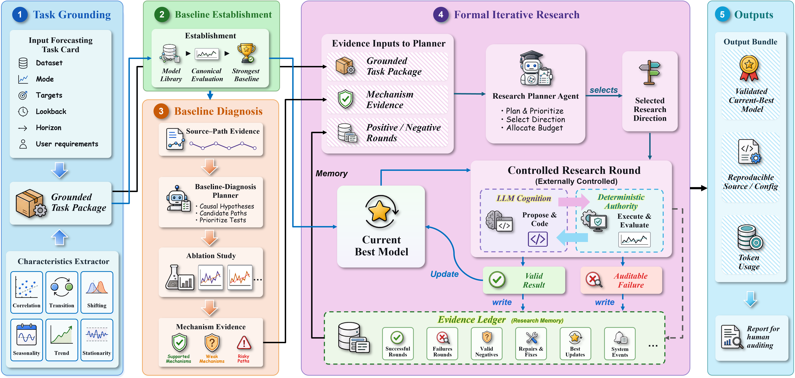

<div align="center">
  
  <h1>EvoCast: Reliable Autonomous Research Agents for Iterative Forecasting Architecture Evolution</h1>
  <p>
    <a href="./README.md"></a>
    <a href="./README_CN.md"></a>
  </p>
  <p>EvoCast is an autonomous research system for deep time-series forecasting development. It automatically performs module-level architecture composition, function insertion, candidate implementation, and experimental validation in real code repositories. It continuously improves model structures around a given dataset, develops task-specific forecasting models for different application domains, and preserves transparent development paths, fair result comparison, and complete experiment records under a unified and auditable evaluation protocol.</p>
</div>

<p align="center">
  
</p>

---

## Workflow Overview 🔁

EvoCast organizes forecasting architecture development as a fixed research loop. Given a forecasting task and a source repository, it first establishes a task-specific baseline and collects task and mechanism evidence. It then runs controlled research rounds that generate bounded source-level candidates, validate their edits, evaluate them under the canonical forecasting protocol, and update the persistent research state. The workflow ends with an auditable HTML report that summarizes baseline results, candidate attempts, metrics, decisions, and round history.

## Directory Layout 🗂️

```text
./
  evocast/                    Main EvoCast task, research, build, evaluation, and reporting code
  ts_benchmark/               TFB/ts_benchmark integration and forecasting backbones
  characteristics_extractor/  Dataset-characterization utilities
  config/                     Forecasting protocol configurations
  tests/                      Unit and regression tests
  assets/                     README figures and static assets
```

## Dataset Placement 📊

EvoCast accepts either an explicit CSV path or a dataset placed under the repository `dataset/` directory.

Recommended layout:

```text
./
  dataset/
    forecasting/
      ETTh1.csv
      ETTh2.csv
      ETTm1.csv
    custom_task.csv
```

Dataset resolution follows this order:

1. the exact path passed through `--dataset`
2. `dataset/forecasting/<filename>`
3. `dataset/<filename>`

CSV expectations:

- The file must be a readable CSV.
- A time column is required. Common names include `date`, `time`, `timestamp`, `datetime`, and `ds`.
- Wide-format forecasting CSVs should contain one time column and one or more numeric feature columns.
- Long-format CSVs with the schema `date/time`, `data`, `cols` are also supported.

Task-mode requirements:

- `MM`: multivariate input and prediction of all target variables; no explicit target column is required.
- `MS`: multivariate input and prediction of exactly one target column; pass it with `--target`.
- `SS`: univariate input and prediction of one target column; `--target` is recommended.

Practical notes:

- If `--time-col` is omitted in interactive use, the wizard will ask for it explicitly.
- If the target column is not valid for the selected task mode, the validator will stop before execution.
- Wide-format non-numeric columns are dropped before modeling and cannot be used as forecasting targets.

Minimal example:

```bash
python -m evocast --dataset dataset/forecasting/ETTh1.csv --time-col date
```

## Environment ⚙️

Create and activate a clean Python environment from the repository root:

```bash
git clone <your-repo-url>
cd <repository-root>
python -m venv .venv
```

Activate the environment:

```bash
# Windows PowerShell
.venv\Scripts\Activate.ps1

# Linux / macOS
source .venv/bin/activate
```

## Requirements 📋

- Python `>=3.10`
- PyTorch-compatible environment
- A local forecasting dataset CSV
- An API key for the selected provider when running LLM-backed research

`requirements.txt` installs the quick-start EvoCast environment. `requirements-full.txt` installs the full repository environment, including dashboard, Darts, Merlion, Mamba, parallel execution, and development tools.

## Installation 📦

Install the quick-start environment:

```bash
python -m pip install --upgrade pip
python -m pip install -r requirements.txt
```

Install the full repository environment when needed:

```bash
python -m pip install -r requirements-full.txt
```

## Default Parameters 🎛️

These defaults reflect the current interactive wizard and runtime behavior.

| Component | Setting |
| --- | --- |
| Entry point | `python -m evocast` |
| Task definition | dataset, mode, target, lookback, horizon, objective |
| Baseline setup | automatic baseline search or manual baseline selection |
| Dataset diagnosis | `required`, `reuse`, or `skip` |
| Research rounds | controlled iterative rounds with bounded source edits |
| Output report | final HTML review report |
| Runtime root | `.evocast/` |

## Build Mode ⚡

Build mode runs the same autonomous research loop with a reduced execution budget. The task still goes through initialization, baseline establishment, dataset characterization, baseline diagnosis, formal research rounds, state updates, and final HTML reporting.

Build mode switches the training, validation, and test stages from the formal experimental budget to a smoke-test budget. This setting keeps the system structure, baseline-selection logic, diagnosis path, and gate flow unchanged while reducing runtime cost for end-to-end validation.

Build mode fits fast environment checks, provider configuration checks, repository-level edit validation, prompt regression, and preflight verification before longer formal runs.

## Evaluation Protocol 🧪

The forecasting evaluation workflow in this repository follows the benchmark protocol implemented in [TFB](https://github.com/decisionintelligence/TFB). EvoCast builds autonomous research, bounded repository-level implementation, and iterative state updates on top of this forecasting evaluation setup.

## End-to-End Workflow 🚀

### 1. Configure Provider Access

Set the API key for the selected provider.

```bash
# DeepSeek
export DEEPSEEK_API_KEY="your-api-key"

# MiniMax
export MINIMAX_API_KEY="your-api-key"

# OpenAI-compatible provider
export OPENAI_API_KEY="your-api-key"
```

On Windows PowerShell:

```powershell
$env:DEEPSEEK_API_KEY="your-api-key"
$env:MINIMAX_API_KEY="your-api-key"
$env:OPENAI_API_KEY="your-api-key"
```

Provider templates are stored in `evocast/configs/providers/`. Select the provider configuration with `--api-config`, for example `providers/deepseek.yaml`, `providers/minimax.yaml`, or `providers/openai.yaml`.

### 2. Start the Interactive Wizard

```bash
python -m evocast
```

The wizard collects the task configuration, baseline choice, provider, and research budget before starting the workflow.

Useful control options include:

```text
--configure-only           Write the task configuration without starting research
--dry-run                  Validate and compile the configuration without writing runtime state
--resume                   Resume an existing task from canonical state
--max-rounds N             Set the maximum number of research rounds
--dataset-diagnosis-mode   Choose required, reuse, or skip dataset diagnosis
--baseline-strategy        Choose automatic baseline search or manual baseline selection
--api-config               Select a provider configuration
```

### 3. Establish the Baseline

EvoCast compiles the task contract, resolves the baseline strategy, executes the baseline under the configured forecasting protocol, and records the initial task state.

Output path:

```text
.evocast/task_knowledge/<task_id>/
```

### 4. Run Controlled Research Rounds

Each research round proposes one research idea, materializes bounded source edits in an isolated workspace, validates the candidate, executes canonical evaluation, and updates the persistent task state.

Core runtime path:

```text
evocast.scripts.wizard
  -> ResearchLoopService
  -> ResearchContractService
  -> run_agent_v3
  -> VariantForgeBackend
  -> ResearchBuildOrchestrator
  -> BuildAttemptEvaluator and TFBExperimentMetricRunner
  -> EvaluationDecisionKernel
```

### 5. Review Outputs

Runtime state is written under `.evocast/`:

```text
.evocast/
  task_knowledge/<task_id>/
    domain_state.json
    runtime_events.jsonl
    rounds/<research_id>/
  dataset_knowledge/
  baseline_knowledge/
  runs/<task_id>/
  sandboxes/<task_id>/
  result/
  agent_reports/
```

The final report summarizes task configuration, baseline results, candidate attempts, validation outcomes, metrics, resource usage, round history, and promotion decisions.

## Verification ✅

Run repository checks from the project root:

```bash
python -m compileall -q evocast
python -m pytest -q
git diff --check
```

## Acknowledgments 🙏

We thank the authors of [TFB](https://github.com/decisionintelligence/TFB) for open-sourcing a unified time-series forecasting benchmark and evaluation framework. EvoCast uses this benchmark infrastructure as the forecasting evaluation backbone of the repository.
